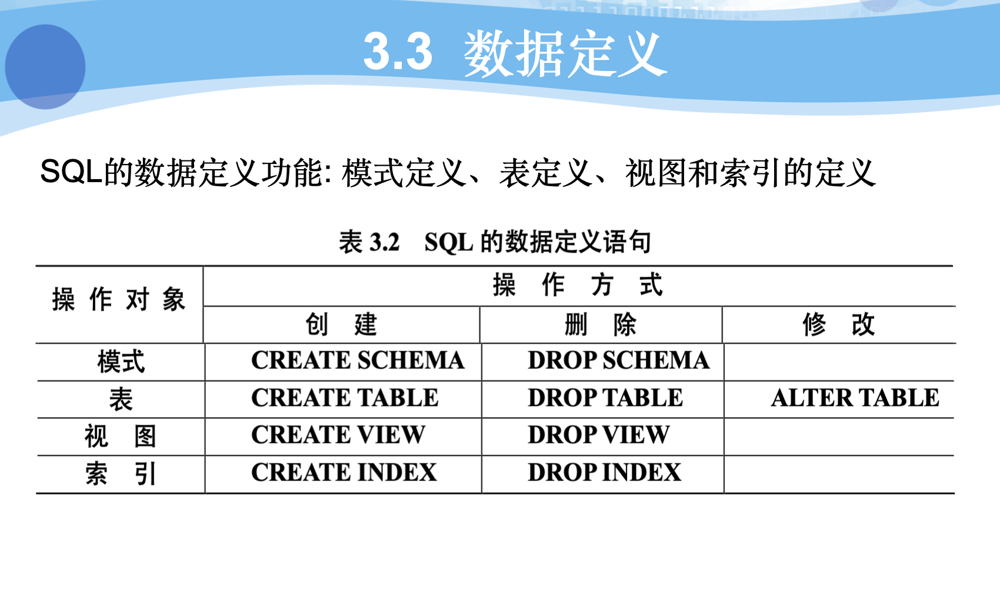
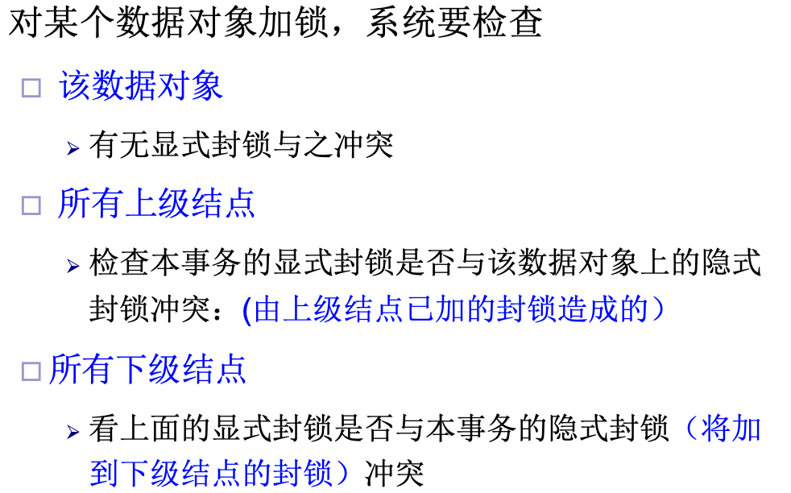

	==shifit + command + H 为markdown的高亮语法快捷键==

- ==数据库系统的特点==：
  - ==数据结构化==
  - ==数据的共享性==
  - 冗余度低
  - 易扩充
  - ==数据独立性高==
  - ==数据由DBMS统一管理和控制==

#### 


#### 0x00.概念模型

- 实体：客观存在且可以相互区分的事物称为实体。
- 属性：实体所具有的某一特性称为属性。
- 码(key)：唯一标识实体的**属性集**称为码。
- 域（domain）：属性的取值范围称为该属性的域。
- **实体型（entity type)：用实体名及其属性名集合来抽象和刻画同类实体称为实体型。**
- **实体集(entity set)：同一类型实体的集合称为实体集。**
- 联系（relationship)：
  - 现实世界事务内部以及事务之间的联系 在信息世界中反映为实体内部的联系和实体之间的联系。
  - 实体内部的联系通常是指组成实体的各属性之间的联系。
  - 实体之间的联系通常是指不同实体集之间的联系。
  - **联系本身也是一种实体型，也可以有属性。**

#### 0x01.关系数据模型的数据结构

- 在用户观点下，关系模型中数据的逻辑结构就是一张二维表。
- 关系：一个关系对应通常说的一张表。
- 元组(tuple)：表中的一行即为一个元组。
- 属性：表中的一列即为一个属性，给每一个属性起一个名称即为属性名。
- 分量：元组中的一个属性值。（关系中的每一个分量都必须是不可分的数据项，不允许表中还有表）。
- **关系数据模型的数据操作是集合操作，操作对象和操作结果都是关系，即若干元组的集合。**
- 存取路径对用户屏蔽，用户只要指出干什么，而不必详细说明怎么干。
- 关系的完整性约束条件：
  - 实体完整性
  - 参照完整性
  - 用户定义的完整性
- 存储结构：
  - 实体以及实体间的联系都用表来表示。
  - 表以文件的形式存储。
- 优缺点：
  - 优点：
    - 建立在严格的数学概念基础上
    - 概念单一：
      - 实体和各类联系都用关系来表示。
      - 对数据的检索结果也是关系。
    - 关系模型的存取路径对用户透明：
      - 具有更高的数据独立性，更好的安全保密性。
      - 简化了程序猿的工作
  - 缺点：
    - 存取路径对用户透明导致查询效率往往不如非关系型数据模型。
    - 为了提高性能，必须对用户的查询请求进行优化。


#### 0x02.数据库系统模式

- 模式：
  - 模式是对数据库逻辑结构和特征的描述
  - 是型的描述。
  - 反映的是数据的结构及其联系。
  - 模式是相对稳定的。
- 实例：
  - 模式的一个具体值。
  - 反映的是数据库某一时刻的状态
  - 同一个模式可以有多个实例
  - 实例随数据库的数据的更新而变动。

#### 0x04.数据库系统的三级模式结构：


- 模式：逻辑模式
  - 数据库中全体数据的逻辑结构和特征的描述。
  - 所有用户的公共数据视图，综合了所有用户的需求。
  - **一个数据库只有一个模式**
  - 地位：是数据库系统模式结构中的中间层。
- 外模式：子模式/用户模式
  - 数据库用户使用的局部数据的逻辑结构和特征的描述。
  - 数据库用户的数据视图，与某一应用的有关的数据的逻辑表示。
  - 地位：介于模式和应用之间。
  - **模式与外模式的关系：一对多**
    - 外模式通常是模式的子集。
  - **外模式和应用的关系：一对多**
    - 同一外模式可以为某一用户的多个应用系统使用。
    - 但一个应用程序只能使用一个外模式。
  - **外模式的用途：**
    - 保证数据库安全性。
    - 每个用户只能看见和访问所对应的外模式中的数据。
- 内模式：存储模式
  - 是数据物理结构和存储方式的描述。
  - 是数据在数据库内部的表示方式。
    - 记录的存储方式：
      - 顺序存储
      - 按照B树结构存储
      - 按照哈希方法存储
    - 索引的组织方式
    - 数据是否压缩存储
    - 数据是否加密
    - 数据存储记录结构的规定
  - 一个数据库只有一个内模式。
- 三级模式是对数据的三个抽象级别
- 二级映像在DBMS内部实现这三个抽象层次的联系和转换。
  - ==外模式/模式映象==
    - **==保证数据的逻辑独立性==：**
      - 当模式改变时，修改外模式/模式映像，而外模式不需要变化。
      - 应用程序是根据数据的外模式编写的，从而应用程序不需要修改，保证了数据与程序的逻辑独立性，简称数据的逻辑独立性。
  - ==模式/内模式映象==
    - 模式/内模式映象定义了数据全局逻辑结构和存储结构之间的对应关系。
      - 例如，说明逻辑记录和字段在内部是如何表示的
    - 数据库中模式/内模式映象是唯一的
    - ==**保证了数据的物理独立性：**==
      - 当数据库的存储结构改变了（例如选用了另一种存储结构），数据库管理员修改模式／内模式映象，使模式保持不变
      - 应用程序不受影响。保证了数据与程序的物理独立性，简称数据的物理独立性
  - 数据库的二级映像
    - 保证了数据库外模式的稳定性
    - 从底层保证了应用程序的稳定性，除非应用需求本身发生变化，否则应用程序一般不需要修改
  - **数据与程序之间的独立性，使得数据的定义和描述可以从应用程序中分离出去** 

#### tips：

**栈和堆的区别：**

- **从内存分布来说**
  - **栈：内存地址由高到低。**
  - **堆：内存地址由低到高。**
- **从数据结构来说**


#### 0x05.关系数据库

- 候选码（Candidate Key）
  - 关系中的一个属性组，其值能唯一标识一个元组。若从属性组中去掉任何一个属性，它就不具有这一性质了，这样的属性组称作候选码
       如DEPT中的D#，DN都可作为候选码
  - **任何一个候选码中的属性称作主属性**
       如SC中的S#，C#
  
- 主码（Primary Key）
  - 若一个关系有多个候选码，则选定其中一个作为主码
       如可选定D#作为DEPT的主码
  
- 外码（Foreign Key）
  - 关系R中的一个属性组，它不是R的码，但它与另一个关系S的码相对应，则称这个属性组为R的外码
       如S关系中的D#属性
  
- **关系模式是型，是稳定的**

- **关系是某一时刻的值，是随时间不断变化的**

- **关系模型的完整性约束：**
  
  - ==实体完整性==：
    - ==关系的主码中的属性值不能为空值（不知道或者无意义）==。
    - 关系对应到现实世界中的实体集，元组对应到实体，实体是相互可区分的，通过主码来唯一标识，若主码为空，则出现不可标识的实体，这是不容许的。
  
- ==参照完整性：==
  
  - 
  - ==即不允许引用不存在的元组。==
  
- 

- 

- 关系的度：即元组的属性个数。

- 选择运算：
  - 
  - 
  
- 投影：
  - 
  - 
  
  
  
- ==**SQL：**==

- 

- 数据定义：

  - 

- 

- sql中的域的概念要用数据类型来实现。

- 

- 每一个基本表都属于某一个模式

- 一个模式包含多个基本表。

- 定义基本表所属模式：
  - 方法一：在表名中明显的给出模式名：
    - create table "S-T".Student(....); #模式名为S-T。
  - 方法二：在创建模式时同时创建表。
  - 方法三：设置所属的模式。
  
- 索引的建立和删除：
  - 建立索引的目的：加快查询速度。
  - 
  - B+树索引具有动态平衡的优点。
  - hash索引具有查找速度快的优点。

-  建立索引：
  - create unique | cluster index index_name on table_name(column1 ASC| DESC, column2 ASC| DESC, ...)
  - 
  - 在最经常访问的的列上建立聚簇索引可以提高查新效率。
  - 一个基本表最多只能建立一个聚簇索引。
  - 经常更新的列不宜建立聚簇索引。
  - 

#### 0x06.简单查询

- 字符串操作：

- 

- eg. select sname from S where sname like '司马_ _ _ _'

- 注意：一个汉字占两个字符

- ```sql
  select * from table where name like '%_d\_ _' escape '\'
  #列出名称中含有4个字符以上的，且倒数第三个字符为'd',倒数第二个字符是'_'的所有信息。
  ```

- 空值：

  - 
  - 
  - 相关嵌套查询：
    - 

- 数据更新：

  - 插入数据：
  - 删除数据：
  - 修改数据：

- 视图：

  - 
  - 

0x07.数据库完整性

- **数据的完整性：**
  - 防止数据库中存在不符合语义的数据，也就是防止数据库中存在不正确的数据。
  - 防范对象：不和语义的，不正确的数据。
  
- **数据库的安全性：**
  - 保护数据库防止恶意的破坏和非法的存取。
  - 防范对象：非法用户和非法操作。
  
- 实体完整性：
  - 
  - ==数据模型的三大要素==：
    - 数据结构
    - 数据操作
    - 完整性约束
  - 


#### 0x07.范式

- 范式是对关系的不同**数据依赖程度**的要求。
- 通过模式分解讲一个低级范式转化为若干个高级范式的过程称为规范化。（概念的纯粹化）。
- 
- 关系规范化的步骤：
  - 
- 1NF
  - 关系中的每一个分量都不可再分，即不能以集合、序列等作为的属性值。
- 2NF
  - 若**R属于1NF**，而且**每个非主属性完全依赖于码（候选码）**，则称R属于2NF。
  - **2NF消除了非主属性对码的部分依赖。**
- 3NF
  - 消除了非主属性对码的传递依赖。
- BCNF
  - 每一个决定因素都包含码（消除主属性对码的部分依赖和传递函数依赖）。
  - 所有非主属性对每一个码都是完全函数依赖
  - 所有主属性对每一个不包含它的码也是完全函数依赖。
  - 没有任何属性完全函数依赖于非码的任何一组属性。
- BCNF和3NF的关系：
  - 
- 多值依赖：
  - 设R（U）为一个属性集合U上的一个关系模式，X，Y和Z均为U的子集，并且Z=U-X-Y,多值依赖X->->Y成立当且仅当对R的任意一个关系r（即任意元组集合），r在（X，Z）上的每个值对应**一组**Y的值，这组值仅仅决定于X值而与Z值无关。
  - 若X->->Y,而Z为空集，则称X->->Y为平凡的多值依赖。否则，则称X->->Y为非平凡的多值依赖。
  - 可以看出，把上面的**一组** 改为 **一个**，那么多值依赖就变成了函数依赖。所以说，**函数依赖是多值依赖的特殊情况**。
- 4NF：
  - 关系模式R<U,F>属于1NF，如果对于R的每个非平凡多值依赖X->->Y(Y不是X的子集)，X都含有码，则称R属于4NF。
  - 4NF不允许有非平凡且非函数依赖的多值依赖。
  - 允许的非平凡多值依赖是函数依赖。
- 关系规范化结论：
  - 范式并非越高越好，范式越高，异常越少，但是查询操作越麻烦。
  - 关系规范化适可而止。
- [数据库求候选码的算法](https://blog.csdn.net/Game_Zmh/article/details/88059438 "最详细的候选码求解")。
- [数据库无损分解和保持依赖的判断-1](https://blog.csdn.net/Summer41074/article/details/5634699?utm_medium=distribute.pc_relevant.none-task-blog-2%7Edefault%7EBlogCommendFromMachineLearnPai2%7Edefault-2.baidujs&depth_1-utm_source=distribute.pc_relevant.none-task-blog-2%7Edefault%7EBlogCommendFromMachineLearnPai2%7Edefault-2.baidujs "最好的解析")
- [数据库无损分解和保持依赖的判断-2](https://blog.csdn.net/qq_34246965/article/details/115943652?utm_medium=distribute.pc_relevant.none-task-blog-baidujs_title-0&spm=1001.2101.3001.4242)


#### 0x08.数据库恢复技术

- 事务的基本概念：

  - 用户定义的一个数据库操作序列。
  - 这些操作要么都做，要么都不做。
  - 一个不可分割的工作单位。

- 事务的ACID特性：

  - 原子性（Atomicity):
    - 事务的所有操作在数据库中要么全部正确反映出来，要么全部都不反映。（All or Nothing)
  - 一致性（Consistency):
    - 事务的执行结果必须是使数据库从一个一致性状态转变到另一个一致性状态。
  - 隔离性（Isolation):
    - 多个事务并发执行时，系统必须保证事务的执行不被其他事务干扰。每个事务都感觉不到系统中有其他事务在并发地执行。
  - 持久性（Durability):
    - 一个事务成功完成后，它对数据库的改变必须是永久性的，即使系统可能出现故障。

- 事务的状态：

  - 

  - 事务的状态图例：

    

- 数据库故障的种类：

  - 事务故障：
    - 逻辑故障：事务由于某些内部条件 （如运算溢出、违反完整性约束）而无法继续正常执行。
    - 系统错误：系统进入一种不良状态（如死锁），使得事务无法巨虚正常执行。
  - 系统故障：硬件或数据库软件或操作系统故障，易失性存储器内容发生丢失，事务处理非正常终止。
  - 介质故障：外存故障
  - 计算机病毒🦠

- 数据库恢复的实现技术：

  - 核心思想：
    - 冗余
  - 实现技术：
    - 数据转储：DBA定期地将整个数据库复制到磁带或另一个磁盘上保存起来的过程。
      - 分类：
        - 转储时间：
          - 静态转储：无事务执行
          - 动态转储：边执行事务，边转储
        - 转储内容：
          - 海量转储：转储全部数据库
          - 增量转储：只转储更新过的数据
    - 日志：日志文件是用来记录事务对数据库的更新操作的文件。
      - 格式：
        - 以记录为单位
          - 内容：
            - 事务标识
            - 操作的类型
            - 操作对象
            - 更新前数据的旧值
            - 更新后数据的新值
        - 以数据块为单位
          - 内容：
            - 事务标识
            - 更新前、更新后块的内容。
    - 日志的主要内容：
      - 事务开始日志记录
      - 事务更新日志记录
      - 事务提交日志记录
      - 事务结束日志记录
    - 记录日志文件：
      - 日志缓冲区：
        - 在内存中开辟的临时保存日志记录的区域
        - 根据需要一次将一个或者多个缓冲块写入磁盘，从而减少写磁盘的次数。
        - 写到磁盘中的日志记录顺序必须与写入日志缓冲区的顺序完全一致。
      - **记录时间**：
        - 必须==先写日志文件，后写数据库==。
          - ==原因==：把对数据的修改写到数据库中和把表示这个修改的日志记录写到日志文件是两个不同的操作。有可能在这两个操作之间发生故障。如果先写了数据库修改，而在运行记录中没有登记这个修改，则以后就无法恢复这个修改了。如果先写日志文件，但没有修改数据库，按照日志文件恢复时不过时多做了一些不必要的undo操作，并不会影响整个数据库的正确性。因此为了安全，一般先写日志文件，再写数据库。
        - WAL协议：（write ahead  log） protocol
  - **==系统故障时，数据库恢复策略：==**
    - ==正向扫描日志文件==，找出故障发生前已经提交的事务，将其事务标记记入REDO队列。同时找出挂帐发生时尚未完成的事务，将其事务标记记入UNDO队列。
    - ==对UNDO队列的各个事务进行撤销处理。==
    - ==对REDO队列的各个事务进行重做处理。==

#### 0x09.并发控制

- ==并发控制：==

  - 当多个事务并发执行时，必须采取一定的控制措施来使某个事务的执行不会影响其他事物产生不良影响。

  - 思想：

    - 通过并发控制使得多个事务的并发调度是可串行化的

  - ==并发控制的问题：==

    - ==读脏数据==
    - ==不可重复读==
    - ==丢失更新==

  - 并发控制的主要技术：

    - 封锁（lock）（2PL） ----->悲观方法

    - 时间戳（Timestamp）

    - 乐观控制法

    - 商用的DBMS一般都采用==封锁==方法

  - 封锁：

    - 定义：

      - 事务T可以向系统发出请求，对某个数据对象加锁（Lock），于是事务T对这个数据对象就有一定的控制权，直到T释放它的锁为止（Unlock)

      - 锁类型：

        - 排他锁（X锁）：若事务T对事务D加上X锁，则其他事务不能对数据D进行任何封锁，保证了其他事务==不能再====读取和修改==D。
        - 共享锁（S锁）：若事务T对数据D加上了S锁，则其他事务能对数据D加上S锁，保证了其他事务==能读取但不能修改==数据D。

      - ==脏数据：==

        - 在数据库运行时，把未提交随后又撤销的数据称为脏数据。
        - 为避免读取脏数据，事务可以通过加上S锁的方法，以防止其他事务对该数据的修改。

      - ==封锁对象的大小==称为==封锁的粒度==。

      - 关系数据库的==封锁对象：属性值、元组、关系、索引==

      - ==封锁协议==的定义：

        - 系统中的每一个事务都必须遵从的关于何时对数据项加上何种锁，何时解锁的一组规则。

        - 三级封锁协议：

          - 一级：

            - 事务Ti在==修改数据==Di之前须先对Di加X锁，直到事务Ti结束才释放

            - 

            - 防止丢失修改 

              保证Ti可恢复

              

          - 二级：

            - 在一级封锁协议加上事务Ti在==读取==Di之前须先对Di加S锁，==读完后即可释放该S锁==

            - 

            - 防止丢失修改 

              防止读脏

              

          - 三级：

            - 在一级封锁协议上加上Ti==读==Di前须先对Di加S锁，==直至Ti结束后才释放该S锁==

            - 

            - 

            - 防止丢失修改 

              防止读脏

              防止不可重复读

  - 活锁：

    - 某事务T等待对数据项加上排他锁，而另一个事务序列的每一个事务都对该数据项加共享锁，则事务T永远不会得到进展。
    - 

  - 死锁：

    - 两个或两个以上的事务均处于等待状态，每个事务都在等待其中另一个事务中封锁🔒的数据解锁🔓，导致任何事务都不能继续执行的情况称为死锁。
    - 
    - 死锁的预防：
      - 一次封锁法：
        - 要求每个事务必须一次将所有要使用的数据全部加锁，否则就不能继续执行。
        - 顺序封锁法：
          - 顺序封锁法是预先对数据对象规定一个封锁顺序，所有事务都按这个顺序实行封锁。
    - 死锁的诊断和解除：
      - 超时法：
        - 如果一个事务的等待时间超过了规定的时间界限，就认为发生了死锁现象。
        - 优点：实现简单。
        - 缺点：
          - 有可能误判死锁
          - 时限若设置过长，死锁发生后不能及时发现。
      - 等待图法：
        - 用事务等待图动态反映所有事务的等待情况
          - 事务等待图是一个有向图*G*=(*T*，*U*)
          - T*为结点的集合，每个结点表示正运行的事务*
          - *U*为边的集合，每条边表示事务等待的情况
          - 若T1等待T2，则T1，T2之间划一条有向边，从T1指向T2
        - 并发控制子系统周期性地（比如每隔数秒）生成事务等待图，检测事务。如果==发现图中存在回路==，则表示系统中出现了死锁
      - 解除死锁：
        - 选择一个处理死锁代价最小的事务，将其撤销
        - 释放此事务持有的所有的锁，使其它事务能继续运行下去
    - 两段锁协议：
      - 定义：
        - 要求每个事务分两个阶段提出加锁和解锁申请
        - 扩展阶段：事务可以获得锁，但不能释放锁
        - 收缩阶段：事务可以释放锁，但不能获得新锁
      - 策略：
        - 在对任何数据读、写之前，须先获得该数据锁
        - 在释放一个封锁之后，该事务不能再申请任何其它锁
      - 
      - 
      - 
      - 封锁对象的大小称为封锁粒度：
        - 封锁的对象：
          - 逻辑单元、物理单元。
          - 
          - 
          - 
          - 
          - 
          - 
          - 意向锁：
            - 
            - 
            - 
            - 
            - 

  - 小结：

    - 
    - ==数据库的并发控制以事务为单位==
    - ==数据库的并发控制通常使用封锁机制==

- ==数据库的保护==：

  - ==4个子系统==：
    - 安全性控制
    - 完整性控制
    - 并发控制
    - 存储管理


​				==shifit + command + H 为markdown的高亮语法快捷键==(勿删)

